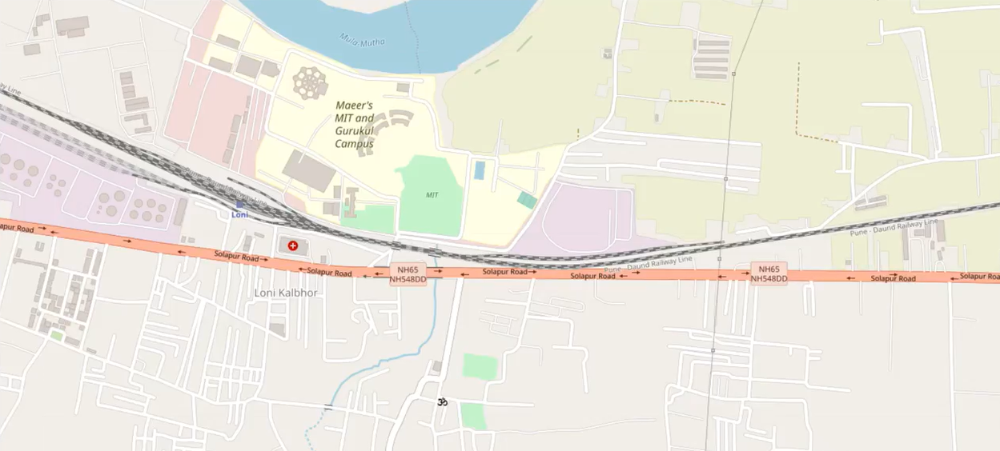
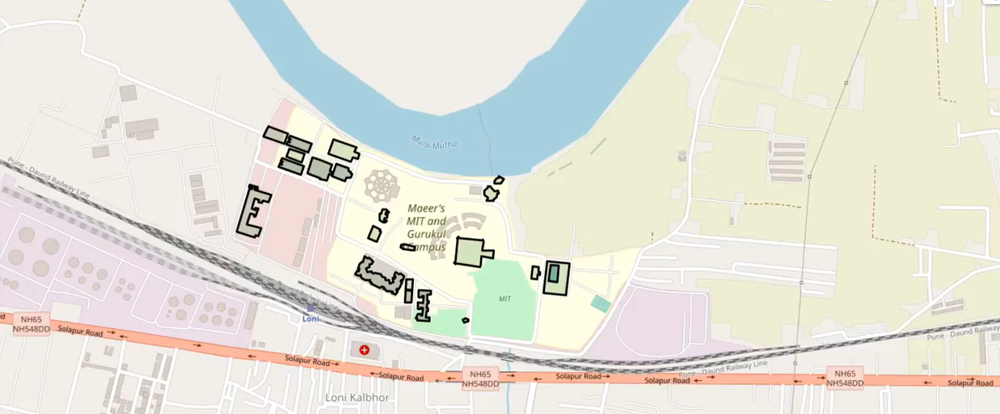
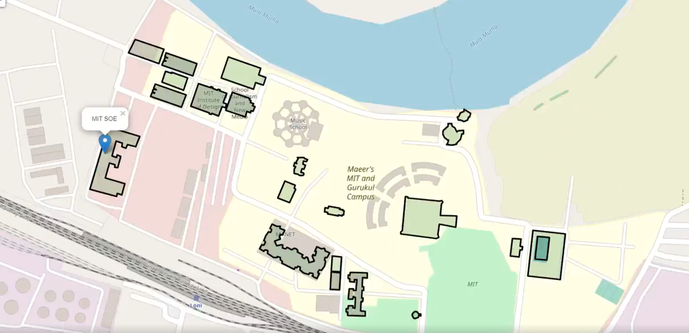
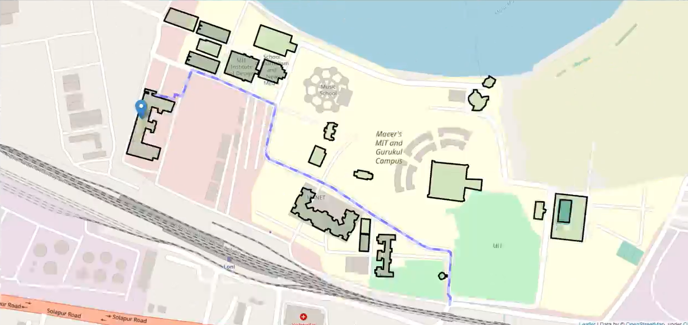

## Campus Navigation
Mapped my college campus using the Folium library with **OpenStreetMap**’s API for interactive visualization.

Integrated and uploaded precise coordinates for over 20 campus landmarks using CSV files, ensuring comprehensive coverage and accuracy of the navigation system.

## Output v1

## Output v2

## Output v3

## Output v4

